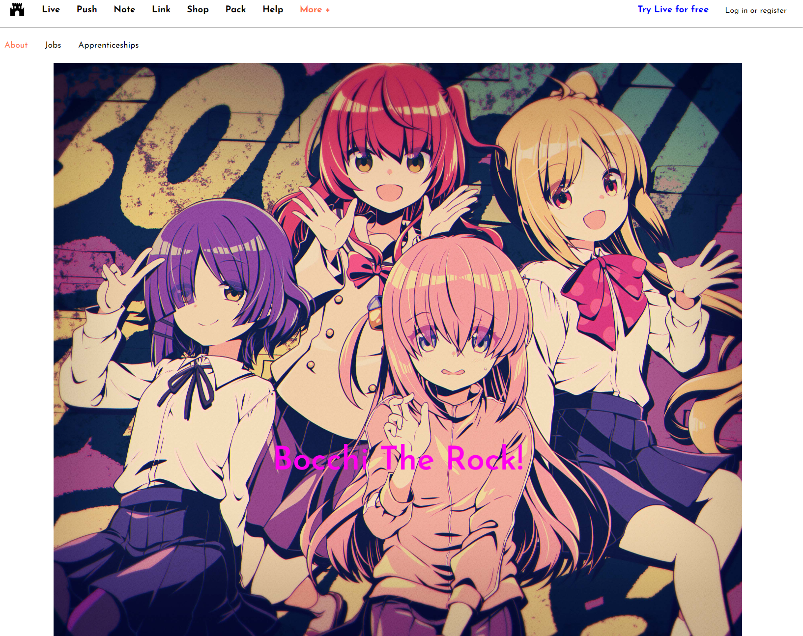
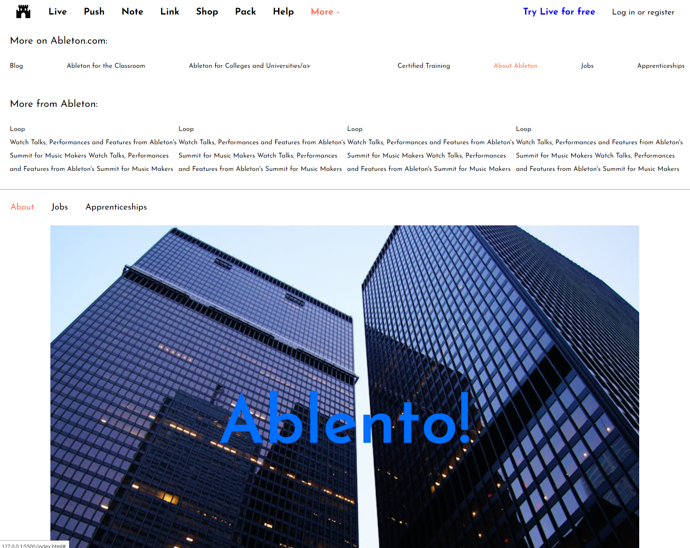
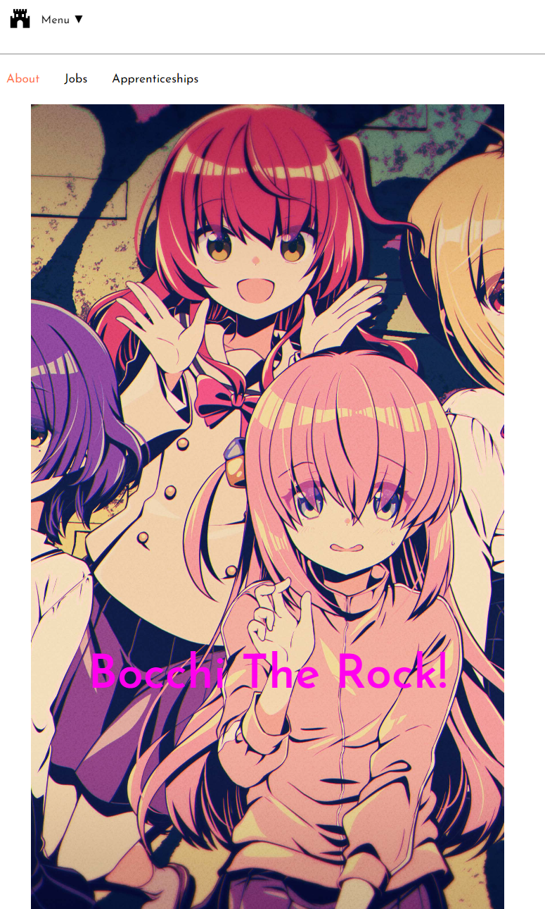
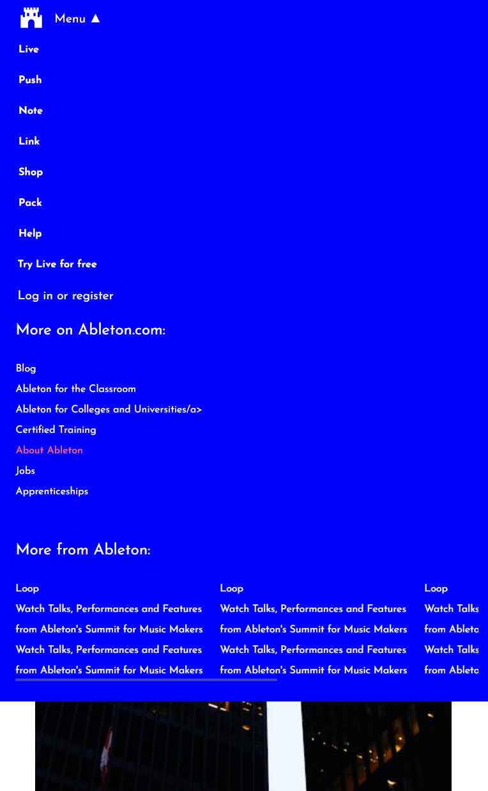

<h1>Frontend Practice - Ableton</h1>

    
    
    
    

<a href="https://zeroryper.github.io/Ableton_Bocchi/">&#10095;Can you checkit here&#10094;</a>

Ableton Bocchi Version

 

MegaMenu extensible using javascript

 

Responsive Page

 

MiniMegaMenu

